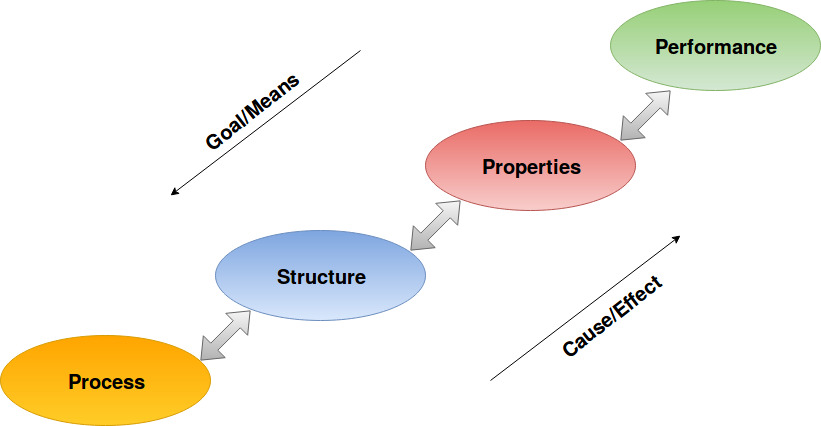
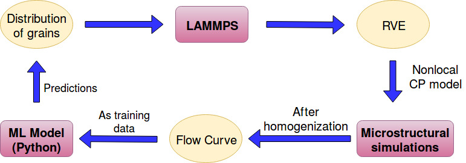

<link rel="stylesheet" href="/style.css" type="text/css" media="all" >

## Reasearch projects

### 1. Structure-Property linkages using Machine Learning
Process-Structure-Property relationship is the crux of materials engineering. To design a material to try to meet a user's need. Based on the user's need we decide upon what properties the material should have (it can be strength, toughness, hydrogen resistance etc.) and then we try to figure  out which structure leads to the desired properties. The structure of the material is tuned by the processing technique used to manufacture the material. This is the inductive or the Goal/Means approach. The other way round is deductive or the Cause/Effect approach where we have a processing technique which decides the structure and that particular structure gives some properties and we try to find some applications for that material with those properties. Below is a schematic

In this project I have particularly focused on structure and property linkages. The ultimate goal of the project is to be able to construct the yield surface of a material by generating yield loci using robust machine learning models under different loading conditions. Before going to advanced analytical models like the Barlat YLD 2004-18p model I have attempted to replace relatively simpler crystal plasticity model called the nonlocal crystal plasticity model as given by [Anxin Ma and Alexander Hartmaier]. The output of the project would lead to a tool which can obviate the need to carry out time consuming and computationally expensive crystal plasticity finite element simulations. The motivation behind using machine learning algorithms comes because of the following reasons:

1. Only requires an initial investment of computational resources to train the model and once it is trained it is ready to be deployed and used
2. Takes very less time to use it and is cost effective
3. Machine learning models are very good at generalization and carefuly trained models also work well on new 'unseen' data points

The below flow chart summarizes the steps involved in the project:

The project involves generation of training data to performing feature engineering and final development of machine learning pipeline to efficiently predict microstructural information from flow curve of the material.

### 2. Internship at Indian Institute of Sciences, Bengaluru

## Course projects

  <b>Some Links:</b> 
  <a href="#">Link 1</a> |
  <a href="#">Link 2</a> |
  <a href="#">Link 3</a>
    
  

[Anxin Ma and Alexander Hartmaier]: https://doi.org/10.1080/14786435.2013.847290
